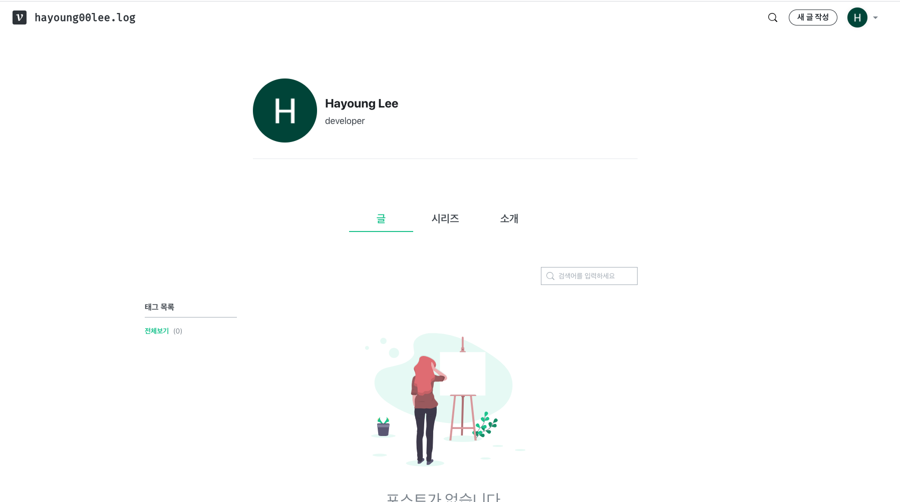
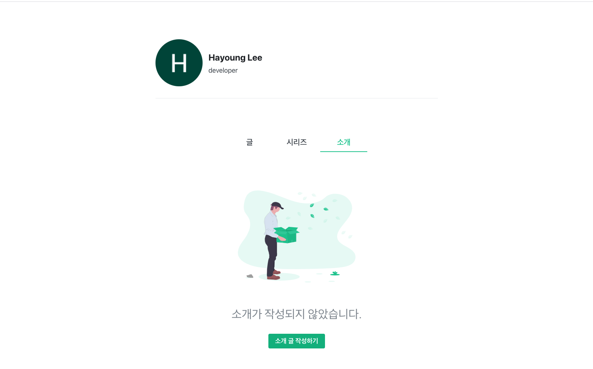
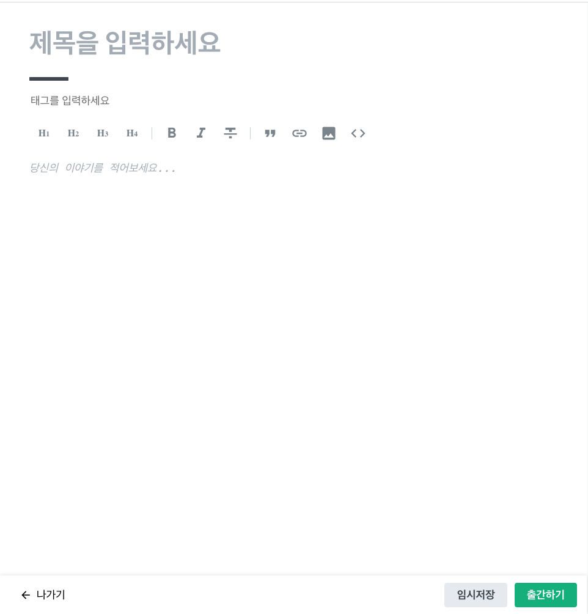
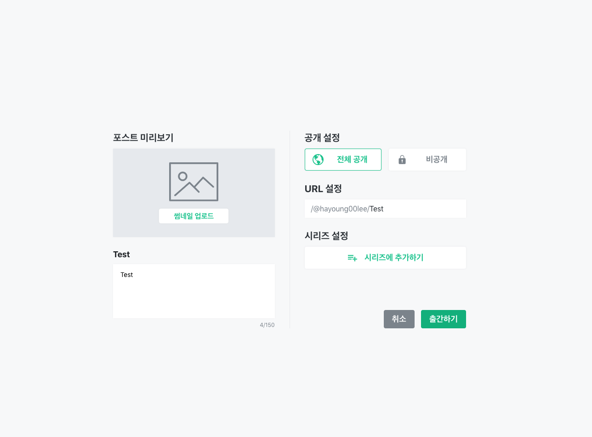
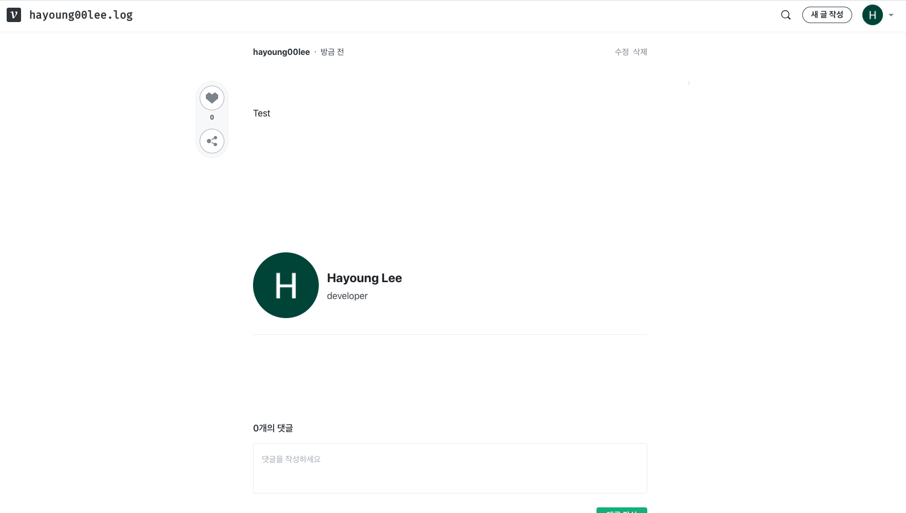
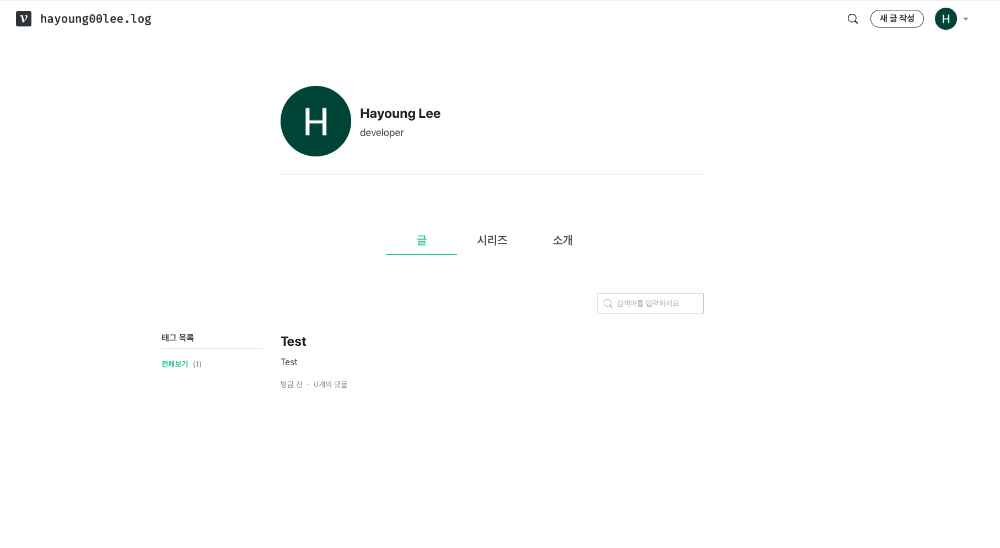
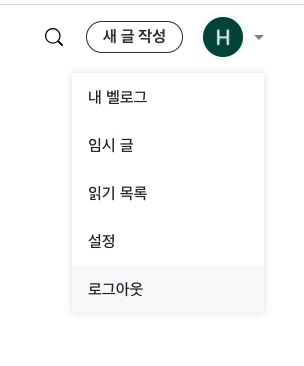
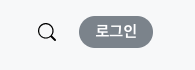
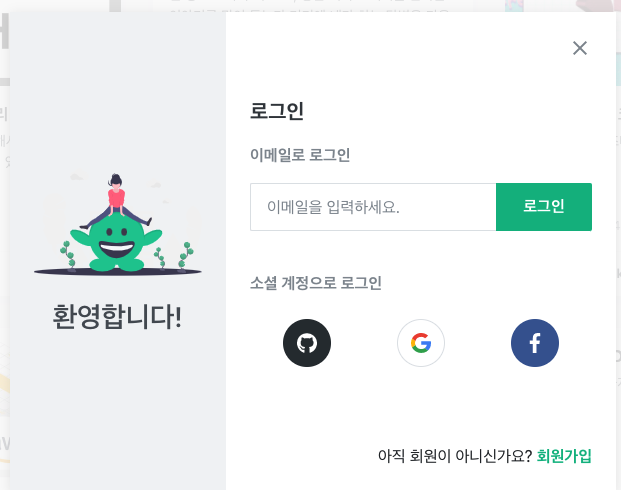

# Starting Next Project(Main feature)

1. Make Next Project

```
npx create-next-app
```

1. [Velog](https://velog.io/)의 기능들:

- main화면

  

- 소개 화면

  

- create 화면

  

- create전 옵션 설정 화면

  

- 글을 읽는 화면

  

- 글 전체 목록

  

- (추가적으로 필요할 기능)그리고 로그인/로그아웃 기능

  - 로그아웃 버튼

    

  - 로그인 버튼

    

  - 소셜 로그인

    

2. 이를 바탕으로 도출한 기능
   - 블로그 글 CRUD
     - markdown file 자체로 스토리지에 저장하고 읽어오는 것 구현
     - 댓글, 대댓글 구현
