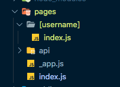
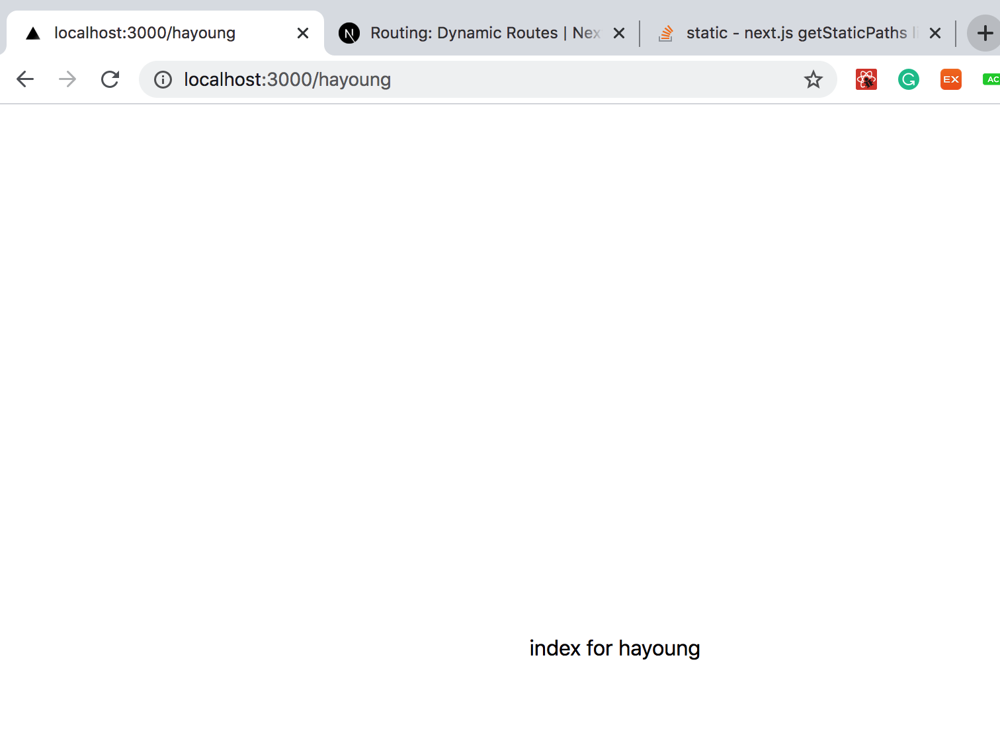
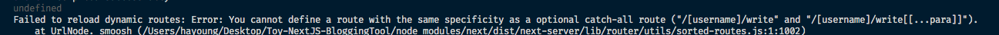

# Create Pages

## 공부할것 및 목표

- [Next.js의 file-system based routing](https://nextjs.org/docs/routing/introduction)
- 그리고 실제로 각 페이지를 간단하게 구현
- `localhost/:id/routing명` 이런식으로 구현하고 픔

## Next.js의 라우팅

Page에 기반해서 file-system 기반의 라우팅을 하고 있다. `pages`에 파일이 추가되면 자동으로 route로 사용가능하다.

- `pages/index.js` -> `/`
- `pages/blog/index.js` -> `/blog`
- `pages/home.js` -> `/home`
- `pages/blog/home.js` -> `/blog/home`

위와 같은 방식이다.

## [Next.js의 다이나믹 라우팅](https://nextjs.org/docs/routing/dynamic-routes)

- `pages/[username]/settings.js`이런식의 라우팅을 하곱다. 왜냐하면 나중에 다른 유저를 받는 모델로 확장할때, 이렇게 해야지 user_id를 쉽게 받아올 수 있을 것 같기 때문이다.

- 이것도 file 기반으로 아주 간단하게 구현 가능하다.



이렇게 했을때 아래처럼 `[username]` 폴더내에 있는 경로로 찾아간다.



- next.js는 `useRouter` hooks를 제공하는데 이를 통해서 어떤 functional component에서든 라우터 객체에 접근이 가능하다. 사용은 아래와 같다.

```javascript
import { useRouter } from "next/router";
import styles from "../../styles/Home.module.css";

const index = () => {
  const router = useRouter();
  const { username } = router.query; // 여기서 [username] 부분을 받아온다
  return <div className={styles.container}>index for {username}</div>;
};

export default index;
```

- 하나더 인상 깊은 것은 catch all routes 와 optional catch all routes 이다

  - `pages/post/[...slug].js` 이렇게 하면 /post/a, /post/b, /post/a/b 이렇게는 match 하지만 /post에는 해당하지 않는다
  - `pages/post/[[...slug]].js` 이렇게 하면 /post, /post/a, /post/b, /post/a/b 랑 다 match 한다.

  - Optional Catch all routes로 구성한 경우에 `post.js`가 상위에 있으면 에러가 발생한다.

    

## route 별 페이지 역할

- `index.js`: 블로그의 진짜 메인, 내 개인 블로그가 아니고 그냥 완전 메인!!
- `/:username/`: 내 블로그의 메인
- `/:username/about`: 내 블로그 소개
- `/:username/write`: 블로그 글 create page
- `/:username/title`: 블로그 글 read page
- `/:username/write?id=articleId`: 블로그 글 수정페이지

## 필요한 API

- crud를 위한 API가 필요

## 후기

나중에 next.js가 어떻게 페이지 기반 라우팅을 구현하고 있는지 파악해보고 싶다. 파일 기반이라는데 내부 구현체를 보면 많은 도움이 될 것 같다.
