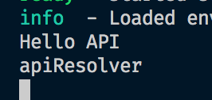
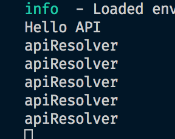
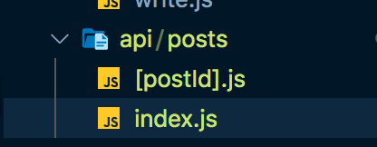
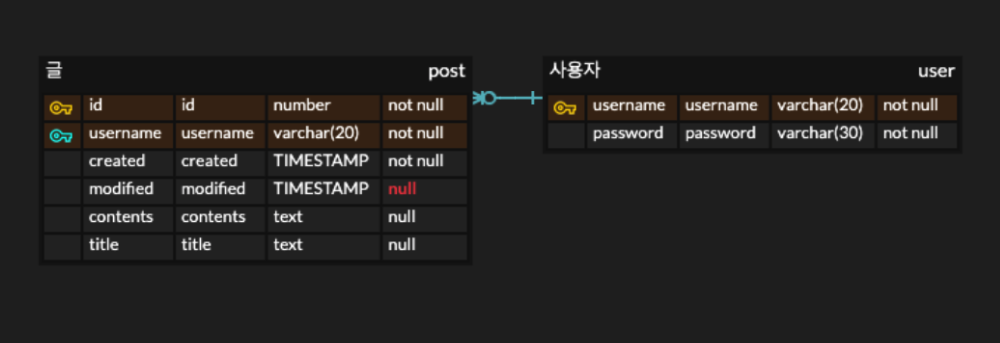

# CRUD 구현해보자

이번 목표는 CRUD를 위한 API endpoints를 만드는 것이다. 나는 custom server를 사용하지 않고 next.js에서 지원하는 api 기능을 활용해서 개발을 해보려고 한다. 추후에 custom server를 사용할 이유가 있을때는 express와 함께 사용해보려고 한다.

## API를 Next.js는 어떻게 처리하나... 대강!

- node_modules/next/dist/next-server/server/next-server.js 파일내를 보면 아래처럼 처리하는 부분이 있다.

```javascript
if (pathname === "/api" || pathname.startsWith("/api/")) {
  const handled = await this.handleApiRequest(req, res, pathname, query);
  if (handled) {
    return { finished: true };
  }
}
```

위와 같은 부분이 있다. `/api`로 시작하는 요청은 여기서 처리해버리고 return을 한다. 이때 handleApiRequest를 타고 어찌저찌 가면 결국 `node_modules/next/dist/next-server/server/api-utils.js` 파일을 참조하고 있다는 것을 알 수 있다.

- 아래는 apiResolver의 내용이다.

```javascript
async function apiResolver(
  req,
  res,
  query,
  resolverModule,
  apiContext,
  propagateError,
  onError
) {
  console.log(
    "apiResolver"
    // req,
    // res,
    // query,
    // resolverModule,
    // apiContext,
    // propagateError,
    // onError
  );
  const apiReq = req;
  const apiRes = res;
```

내가 이걸 확인하는 이유는 `api/hello.js`파일을 아래와 같이 작성하고 요청을 했을때 hello.js 파일을 요청이 왔을때 한번읽고 build하는것 같아서다.

```javascript
console.log("Hello API");
export default (req, res) => {
  res.status(200).json({ name: "John Doe" });
};
```

이렇게 해두면 최초의 `api/hello` 요청이 왔을때는 `console.log("Hello API");`이 출력되고, `apiResolver`가 출력되는데 그다음부터는 `apiResolver`만 출력된다.

- 첫번째:

  

- 그 다음부터

  

이 이상으로 파악은 어려운데, api관련 기능 처리관련해서는 `apiResolver` 에서 처리가 일어나고 있다는것을 파악했고, 이제 잘되어있겠구나... 믿고 기능을 개발해보려고 한다.

## CRUD를 위한 Rest api endpoint만들기

- API또한 page를 구성할때와 거의 같다(같은것 같다..)

    

  - 위처럼 구성하면 `api/posts` 요청은 index.js 파일에서 정의 가능하다.
  - `api/posts/:postId`는 [postId].js 파일에서 정의할 수 있다.
  - 이렇게 아래의 api를 정의하고 기능을 구현하려고 한다.

    ```javascript
    // api/posts/index.js에 정의
    // GET api/posts

    // GET api/posts?title=[kw]

    // POST api/posts

    // api/posts/[postId].js에 정의
    // GET api/posts/:postId

    // PUT api/posts/:postId

    // DELETE api/posts/:postId
    ```

## [username]/index.js 를 구성하면서 살펴본 getStaticPaths, getStaticProps 그리고 revalidate 속성

- [username]/index.js를 incremental static generation 방식으로 생성하고 싶었다. 왜냐하면 여기서는 블로그의 글을 모두 보여주긴하는데, 그렇다고 내가 글을 매초단위로 생성하는게 아니다보니 적당한 시간에 한번씩 revalidate하면 되겠다고 생각했다.

- 우선 dynamic route를 사용하는 경우에는 어떤 path에 대해서 build를 할지 지정해줘야한다. 그래야 지정한 path에 대해서 build해두기 때문이다.

```javascript
export async function getStaticPaths() {
  return {
    paths: [
      { params: { username: process.env.NEXT_PUBLIC_USERNAME } }, // See the "paths" section below
    ],
    fallback: false, // See the "fallback" section below
  };
}
```

나는 지금은 딱 내이름에 대해서 하나만 build하면되서 이렇게 생성했다. `fallback: false`인 경우에는 여기에 설정한 path외의 요청은 404페이지를 반환하는 것이다. `true`라고 설정하면 build하지 않은 요청이 들어오면 그때서야 build한다.

- `getStaticProps` 각 path에 대해서 data-fetching을 실행한다.
  - 여기서 revalidate 속성이 있으면 incremental static regeneration 이다.
  - `revalidate: An optional amount in seconds after which a page re-generation can occur`
    - 10으로 주면 10초가 지난후에 page regeneration이 발생한다.
    ```javascript
    export async function getStaticProps() {
      const posts = dummy;
      // const posts = await res.json();
      console.log("getStatic props");
      return {
        props: {
          posts,
        },
        // Next.js will attempt to re-generate the page:
        // - When a request comes in
        // - At most once every second
        revalidate: 10, // 10초설정
      };
    }
    ```

## Tab 컴포넌트 구성

## Read Page

### Markdown to html

- https://github.com/jonschlinkert/remarkable
- https://ourcodeworld.com/articles/read/396/how-to-convert-markdown-to-html-in-javascript-using-remarkable

- dangerouslySetInnerHTML: https://reactjs.org/docs/dom-elements.html#dangerouslysetinnerhtml

## Create Page

- form: https://developer.mozilla.org/en-US/docs/Web/HTML/Element/form

- form guide: https://developer.mozilla.org/ko/docs/Learn/Forms

- 내가 에디터를 만든 방식에 관해서는 블로그에 따로 정리를 했다. [visit here](https://mytutorials.tistory.com/322)

- [next.js의 form](https://nextjs.org/blog/forms)

## Database 달기

이전에는 json으로 테스트만하다가 이제 진짜 제대로 데이터를 생성, 수정, 삭제 해야할 것 같아서 db를 간단하게라도 달아보려고한다.

- sql vs noSQL: https://siyoon210.tistory.com/130
- rdbms로 구성해서 문서를 저장하는것이 좋을 것 같다.

간단하게 구성할것이긴 하지만, 그래도 어떤 db를 사용하면 좋을지 고민했는데, 나는 간단하게 article에 대해서 정보를 저장하는 post table과 user가 지금은 한명이지만 이에 대한 정보를 저장하는 user table만을 가지고 시작하려고 한다.

- erd는 [이곳](https://www.erdcloud.com/)에서 그렸다. 그릴때는 [여기](https://codecow.tistory.com/1)를 참고했다.
- post의 contents를 저장할때 길이 제한이 어떻게 되나해서 찾아본 [자료](https://www.postgresql.org/docs/9.6/datatype-character.html). text의경우 길이가 unlimited라고 하나 물리적으로 1gb까지 가능하다고 한다.



- docker file: `docker exec -it postgres-db psql --username postgres`
- adminer를 사용

```
reate table blog_user (
  username varchar(20) not null,
  password varchar(20) not null,
  primary key (username)
);

create table blog_post (
  id serial not null,
  created timestamp,
  modified timestamp,
  username varchar(20) not null,
  contents text,
  primary key (id),
  foreign key (username) references blog_user (username)
);

insert into blog_user(username, password) values ('hayoung', '1234');
```

- node postgres: https://node-postgres.com/

## 참고자료

- https://velog.io/

- https://nextjs.org/docs/api-routes/introduction

- How to save markdown

  - [DEV: How should markdown be saaved and rendered?](https://dev.to/michael/how-should-markdown-be-saved-and-rendered-51f)
  - [How would you store markdown?](https://www.reddit.com/r/Database/comments/iwvjse/how_would_you_store_markdown/)
  - [What is the best way to store a field that supports markdown in my database when I need to render both HTML and “simple text” views?](https://stackoverflow.com/questions/17250972/what-is-the-best-way-to-store-a-field-that-supports-markdown-in-my-database-when)

- velog: https://github.com/velopert/velog
  - v2는 여기: https://github.com/velopert/velog-server
