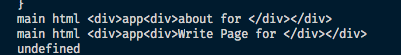

# Styling

화면 진짜 구성하기~

## [Custom `App`](https://nextjs.org/docs/advanced-features/custom-app)

## [Custom `document`](https://nextjs.org/docs/advanced-features/custom-document)

> The <Head /> component used here is not the same one from next/head. The <Head /> component used here should only be used for any <head> code that is common for all pages. For all other cases, such as <title> tags, we recommend using next/head in your pages or components.

- `_document`의 `<Head/>`컴포넌트는 `next/head`랑은 다르다. `<Head/>`컴포넌트는 모든 페이지에 공통으로 사용되는 `<head>`만 포함이 되어야한다. `title`같은 다른 케이스들의 경우 페이지나 컴포넌트에서 사용하는 것을 추천한다.
- `_document`는 서버에서만 렌더링된다, `onClick`같은 건 동작안한다

- `_document`의 헤더와 page의 `next/head`가 겹치면 page의 head가 덮어쓰기 한다. 기본적으로는 document의 헤더가 모두 포함된다.

- [`Main` and `NextScript`](https://stackoverflow.com/questions/52083848/nextjs-main-and-nextscript)

  - 이거랑은 좀 달라졌고 `document.js` 파일은 `/node_modules/next/dist/pages/_document.js`에 있다.
  - `Main`이 어떻게 생겼는지 봤더니 여기서 Main에서 app을 내용을 가져오고, 이 app은 또 page를 가져오는 식이었다.

    ```javascript
    function Main() {
      const { inAmpMode, html, docComponentsRendered } = (0, _react.useContext)(
        _documentContext.DocumentContext
      );

      console.log("main html", html);
      docComponentsRendered.Main = true;
      if (inAmpMode)
        return /*#__PURE__*/ _react.default.createElement(
          _react.default.Fragment,
          null,
          _constants.AMP_RENDER_TARGET
        );
      return /*#__PURE__*/ _react.default.createElement("div", {
        id: "__next",
        dangerouslySetInnerHTML: { __html: html },
      });
    }
    ```

    위는 실제 `Main`을 구현하는 함수인데, 여기서 보면 html을 불러오고 있다. `html`이 뭘가리키는지 봤더니 `_app`의 내용을 가져오고 있었다.

    내가 그래서 app을 아래처럼 바꿨다.

    ```javascript
    // _app.js
    function MyApp({ Component, pageProps }) {
      return (
        <div>
          app
          <Component {...pageProps} />
        </div>
      );
    }
    ```

    이렇게 해서 확인해보면 app과 그안에 page까지 불러와서 build할때 document가 실행된다.

    

## [styled-components](https://styled-components.com/docs)

## 참고자료

- 볼때마다 헷갈리는 [media query](https://developer.mozilla.org/ko/docs/Learn/CSS/CSS_layout/Media_queries)
